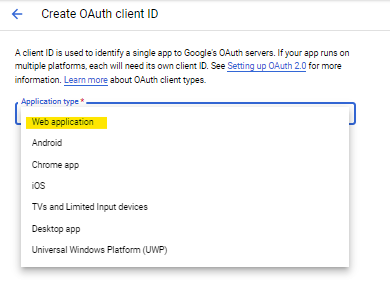
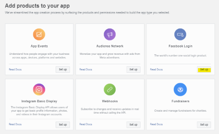

# WikiFamily Project

## About
WikiFamily project is a user-friendly website that serves as a mean of understanding an individual’s genealogy and providing a great way to encode family history for posterity. The website is a tool for users to create, modify, and view their or an individual’s family tree.

## Frameworks
* Python Flask
* ReactJS

## Additional information // Other Things Required in Order to Run
* For React
    * Don't edit index.js file, there's nothing to change there.\
    * Use files in `pages` folder to change website's pages.\
    * Use files in `components` folder to change the elements of website's pages.\
    * Use files in `style` folder to change css files.
    * `npm run build` Builds the app for production to the `build` folder.\
        * It correctly bundles React in production mode and optimizes the build for the best performance.

## Access the project code 
[Click here to see the project repository](https://github.com/matyevaa/wikifamily)

## Access the deployed version
* WikiFamily frontned --> [WikiFamilyfront](https://wikifamilyfront.herokuapp.com/)
* WikiFamily tree backend API --> [Wikifamily](https://wikifamily.herokuapp.com/)
* WikiFamily login API --> [wikifamily-login](https://wikifamily-login.herokuapp.com/)

## Creating API keys for third-party logins
* Google
    * Create a developer account with Google
    * [Go to the credentials page](https://console.developers.google.com/apis/credentials)
    * Click on "Create Credentials"
    
    * Click on “OAuth client ID”
    
    * Click on “Web Application”
    
    * Name the application and click “Create”
    * Once your OAuth client is created, you will receive your client ID and secret. At this point you can save the JSON file. If not, you can always access your client credentials at a different point.
    
    * Add the following URIs by clicking on “+ Add URI”. These URIs take into account if the website is being run on localhost, 127.0.0.1, or on the WikiFamily Heroku page
        * http://127.0.0.1:3000/auth/google/wikifam
        * http://127.0.0.1:3000/auth/google/wikifam/
        * http://127.0.0.1:3000/auth
        * http://localhost:3000/auth/google/authorized
        * http://localhost:3000/auth/
        * http://localhost:3000/auth/
        * https://wikifamily-login.herokuapp.com/auth/google/authorized
        * https://wikifamilyfront.herokuapp.com/
    
    * After entering the URIs click save.
    * In the WikiFamily Project in the folder loginApi find app.py and replace the current client ID and secret on line 59 with your new client credentials.
    * The Google login works both on the Heroku version and localhost.

* Facebook
    * [Create an account with Facebook’s developer page](https://developers.facebook.com/)
    * [Go to "My Apps"](https://developers.facebook.com/apps)
    * Click on "Create App"
    
    * Select the app type
    
    * Enter a project name and an email address to be contacted at 
    * Click “Set up” on the Facebook Login option
    * 
    * Click on the "Web" option
    
    * Enter the Heroku login API link (https://wikifamily-login.herokuapp.com/) and click “Save” then “Continue”
    
    * On the left panel, click on “Settings” then “Basic”
    
    * At the top of the page you will see your App ID and secret
    
    * In the project folder, in the folder loginApi find the file app.py and replace the client secret and app ID in line 55 with your created credentials
    * Going back to the Basic settings page, in the section “Privacy Policy URL” insert the link “https://wikifamilyfront.herokuapp.com/privacy”
    * In the “User data deletion” change the default option “Data deletion instructions URL” to “Data deletion callback URL” and insert the following link “https://wikifamily-login.herokuapp.com/deleteFB”
    
    * Click “Save changes” at the bottom right corner /
    * On the left panel find the “Facebook Login” category and click on “Settings”
    * In the “Valid OAuth Redirect URIs” section add the following links
        * https://localhost:3000/auth/facebook/wikifam
        * https://localhost:3000/auth
        * https://wikifamily-login.herokuapp.com/auth/facebook/wikifam
        * https://wikifamily-login.herokuapp.com/auth/facebook/wikifam/facebook/authorized
    * In the “Deauthorize” section include the following link “https://wikifamily-login.herokuapp.com/deleteFB” and click save changes in the bottom right corner
    
    * Facebook login will only work on the deployed version

## Git clone the project

## How to Run the project...
* backend
    1. open a command line for backend folder
    2. If you need to install the dependencies run `$ pip install -r requirements.txt`
    3. run `$ Scripts\activate`
    4. run `$ python3 api.py` OR `$python api.py` depending on your python version
    5. Should run on [localhost:5000](http://localhost:5000)
* loginApi
    1. open a command line for loginApi folder
    2. If you need to install the dependencies run `$ pip install -r requirements.txt`
    3. run `$ Scripts\activate`
    4. run `$ python3 app.py` OR `$python app.py` depending on your python version
    5. Should run on [localhost:3000](http://localhost:3000)
* wikifamily react
    1. open a command line for the wikifamily folder
    2. run `$ npm start`
    3. Should run on [localhost:3005](http://localhost:3005)

## Software Packages 
* LoginApi and Backend Packages -- located in each folders requirements.txt
    * atomicwrites==1.4.0
    * attrs==21.2.0
    * Authlib==0.15.5
    * Babel==2.9.1
    * beautifulsoup4==4.9.3
    * blinker==1.4
    * cachelib==0.6.0
    * certifi==2021.5.30
    * cffi==1.15.0
    * charset-normalizer==2.0.4
    * click==8.0.1
    * colorama==0.4.4
    * coverage==5.5
    * cryptography==35.0.0
    * Deprecated==1.2.13
    * docopt==0.6.2
    * facepy==1.0.12
    * flake8==3.9.2
    * Flask==2.0.2
    * Flask-BabelEx==0.9.4
    * Flask-Cors==3.0.10
    * Flask-Dance==5.1.0
    * Flask-Helper==1.2.7
    * Flask-Login==0.5.0
    * Flask-Mail==0.9.1
    * Flask-MySQL==1.5.2
    * Flask-MySQLdb==0.2.0
    * Flask-OAuth==0.12
    * Flask-Principal==0.4.0
    * Flask-Security==3.0.0
    * Flask-Session==0.4.0
    * Flask-Social==1.6.2
    * Flask-SQLAlchemy==2.5.1
    * Flask-WTF==0.15.1
    * greenlet==1.1.2
    * gunicorn==20.1.0
    * html5lib==1.1
    * httplib2==0.20.2
    * idna==3.2
    * iniconfig==1.1.1
    * itsdangerous==2.0.1
    * Jinja2==3.0.1
    * MarkupSafe==2.0.1
    * mccabe==0.6.1
    * mysql==0.0.3
    * mysql-connector==2.2.9
    * mysql-connector-python==8.0.27
    * mysqlclient==2.0.3
    * numpy==1.21.1
    * oauth2==1.9.0.post1
    * oauthlib==3.1.1
    * packaging==20.9
    * pandas==1.3.1
    * passlib==1.7.4
    * pipreqs==0.4.10
    * pluggy==0.13.1
    * protobuf==3.19.3
    * psycopg2==2.9.3
    * py==1.10.0
    * pycodestyle==2.7.0
    * pycparser==2.21
    * pyflakes==2.3.1
    * PyMySQL==1.0.2
    * pyparsing==2.4.7
    * pytest==6.2.4
    * pytest-cov==2.12.0
    * python-dateutil==2.8.2
    * python-dotenv==0.19.2
    * pytz==2021.1
    * redis==4.1.2
    * requests==2.26.0
    * requests-oauthlib==1.3.0
    * six==1.16.0
    * soupsieve==2.2.1
    * speaklater==1.3
    * spotipy==2.18.0
    * SQLAlchemy==1.4.27
    * toml==0.10.2
    * urllib3==1.26.6
    * URLObject==2.4.3
    * webencodings==0.5.1
    * Werkzeug==2.0.1
    * wrapt==1.13.3
    * WTForms==2.3.3
    * yarg==0.1.9

* Native React Packages -- located in package.json
    * "@auth0/auth0-react": "^1.9.0",
    * "@headlessui/react": "^1.6.3",
    * "@testing-library/jest-dom": "^5.14.1",
    * "@testing-library/react": "^11.2.7",
    * "@testing-library/user-event": "^12.8.3",
    * "axios": "^0.24.0",
    * "bootstrap": "^5.1.3",
    * "clone": "^2.1.2",
    * "firebase": "^9.6.7",
    * "git-remote-origin-url": "^4.0.0",
    * "http-proxy-middleware": "^2.0.1",
    * "react": "^17.0.2",
    * "react-burger-menu": "^3.0.6",
    * "react-d3-tree": "^3.2.1",
    * "react-dom": "^17.0.2",
    * "react-expandable-treeview": "^1.0.1",
    * "react-hook-form": "^7.30.0",
    * "react-icons": "^4.3.1",
    * "react-router-dom": "^5.3.0",
    * "react-scripts": "4.0.3",
    * "react-social-login-buttons": "^3.6.0",
    * "react-youtube": "^7.14.0",
    * "reactjs-popup": "^2.0.5",
    * "uuid": "^8.3.2",
    * "web-vitals": "^1.1.2"

## Unrealized features
* Uploading pictures of individuals through the database and displaying them on individual's detailed information window on Tree View page
* Displaying the tree list view while editing the individuals to let the user see which person they are editing
* Enabling CRUD operations for tree graph option

Our project was bootstrapped with [Create React App](https://github.com/facebook/create-react-app).

See the section about [deployment](https://facebook.github.io/create-react-app/docs/deployment) for more information.
